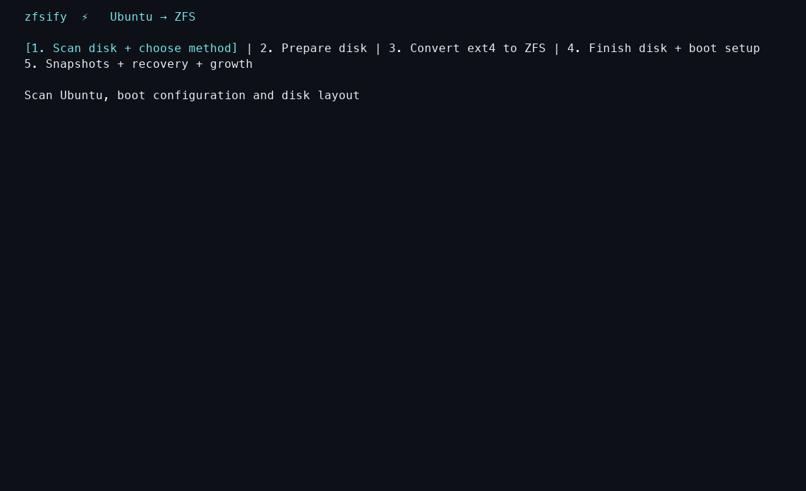
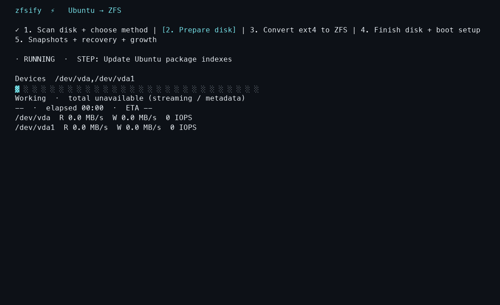
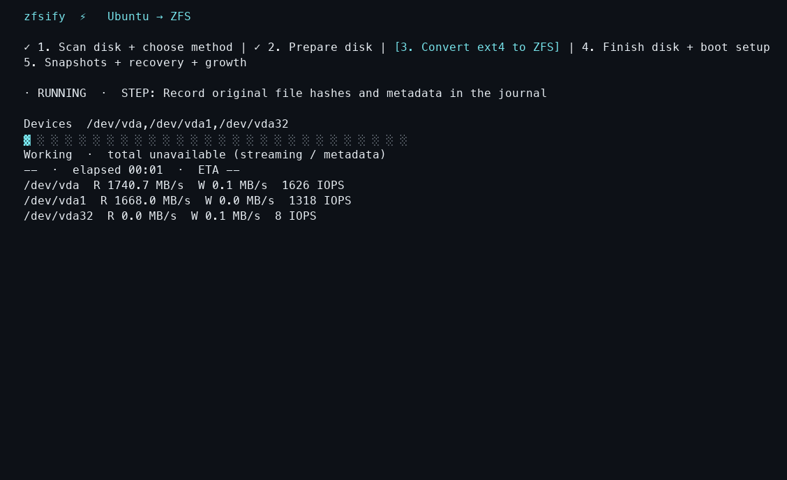
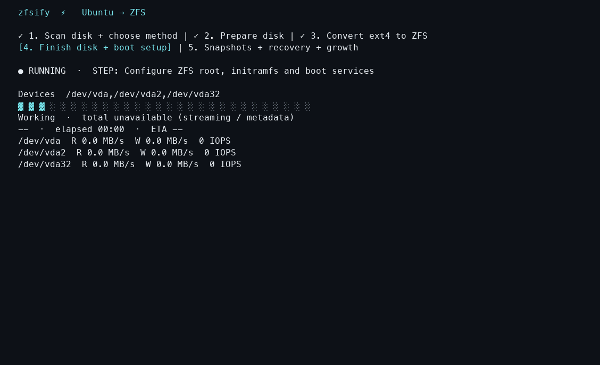
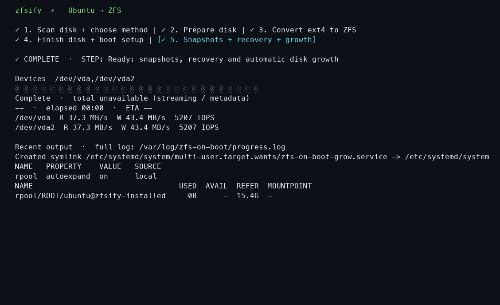
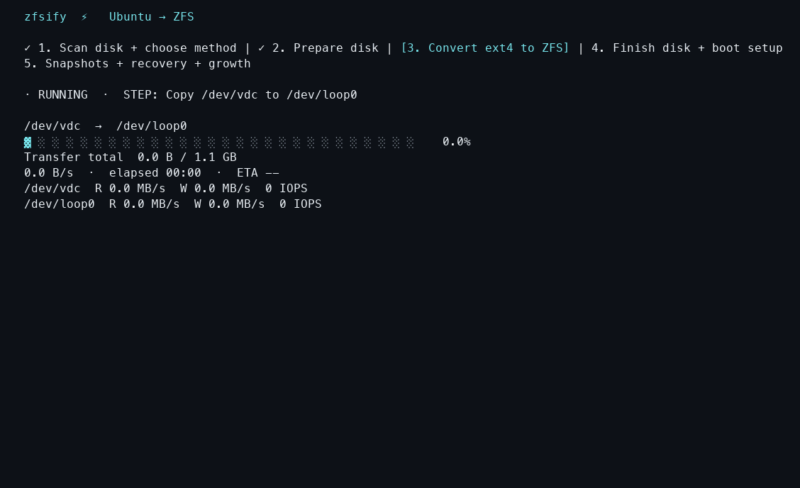
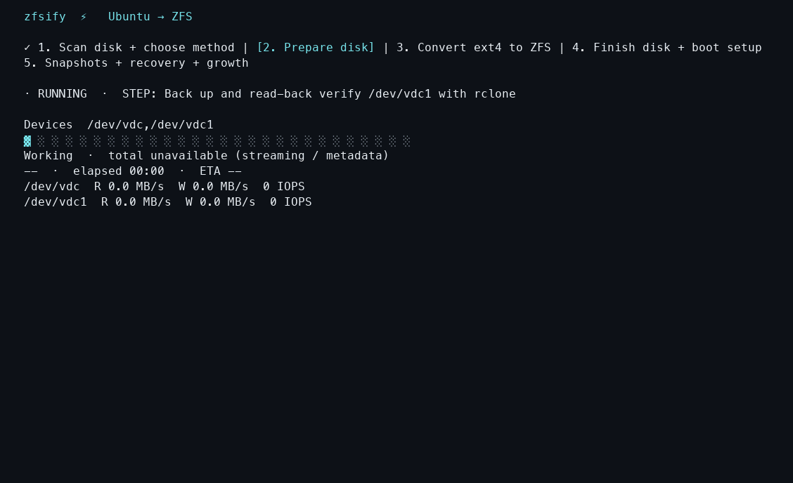
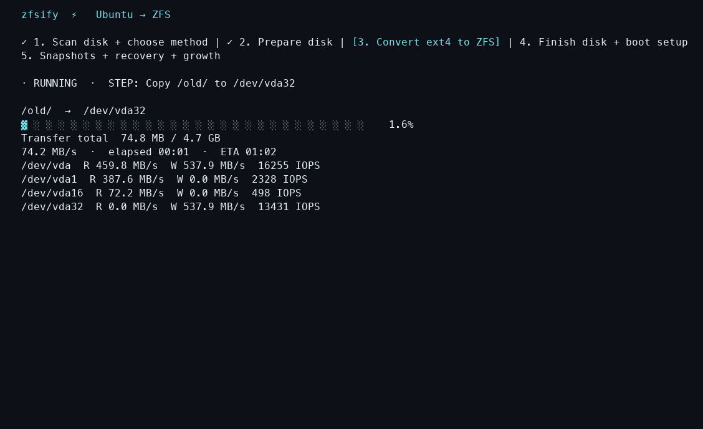

<div align="center">

# ⚡ zfsify

Convert an Ubuntu VPS or attached volume from ext4 to ZFS with one command,
preserving existing data through in-place filesystem conversion.

[](#requirements)
[](#before-you-start)
[](LICENSE)

</div>

<p align="center">
<a href="https://pirate.github.io/zfsify/docs/recordings.html?clip=phase-1"></a>
<a href="https://pirate.github.io/zfsify/docs/recordings.html?clip=phase-2"></a>
<a href="https://pirate.github.io/zfsify/docs/recordings.html?clip=phase-3"></a>
<a href="https://pirate.github.io/zfsify/docs/recordings.html?clip=phase-4"></a>
<a href="https://pirate.github.io/zfsify/docs/recordings.html?clip=phase-5"></a>
</p>

Cloud providers usually ship Ubuntu with ext4. Getting ZFS means building a
custom boot image or manually partitioning disks and migrating your files.
zfsify automates that work for the boot drive, including / and /boot, and
attached data volumes.

Create a normal Ubuntu VPS or volume on DigitalOcean, Vultr, Hetzner, AWS, GCP,
Azure, or another provider, then run zfsify inside Ubuntu. It transfers your
installation onto ZFS so you can use snapshots, compression, checksums, booting
from snapshots, and all the other benefits of ZFS.

## Choose a setup

- **Existing Ubuntu server or VM:** convert ext4 `/`, including `/boot`, on its current disk.
- **Attached disk or volume:** convert ext4 using its mount point, such as `/mnt/data`, or block-device path, such as `/dev/disk/by-id/...`; retain its files and mount point.
- **New Ubuntu server:** use the [cloud-init templates](docs/cloud-init.md) to convert the boot disk or an attached volume after provisioning.

## Before you start

**Experimental software: make a full offsite backup before proceeding.**
Repartitioning or an interrupted conversion can destroy data or leave the disk
unbootable.

Before running the command:

- **Boot drive (`/`):** allow server downtime and two reboots; confirm access to the VM or provider's recovery console.
- **Attached volume:** stop applications that use it; allow volume downtime until conversion finishes.

## Quick start

```sh
# Convert the Ubuntu boot drive.
curl -fsSL https://pirate.github.io/zfsify/reformat.sh | sudo sh

# Or convert an attached ext4 disk; replace the path with your disk's ID.
curl -fsSL https://pirate.github.io/zfsify/reformat.sh | sudo bash -s -- /dev/disk/by-id/YOUR-DISK
```

Review the highlighted method and disk, then explicitly confirm conversion.
The interactive flow has no automatic start or timeout; method options preselect
the method for review. Convert one disk per invocation.

## Requirements

- **System:** Ubuntu 22.04, 24.04, or 26.04 on x64 or ARM64; internet access to Ubuntu package repositories.
- **Source disk:** ext4 on a direct disk or partition with 512-byte logical sectors; no LVM, RAID, or encrypted sources. Attached disks: one source filesystem, with room for a second copy or a separate backup.
- **Boot-drive resources:** 512 MiB RAM; working space for package preparation and conversion, plus room in `/boot` for the temporary kernel and boot image.
- **Boot-drive setup:** GPT and GRUB; BIOS or UEFI on x64, UEFI on ARM64; Secure Boot disabled. A separate ext4 `/boot` is supported.
- **SSH:** for boot-drive conversion, a public key in `/root/.ssh/authorized_keys`; copied to rescue and fresh installs to preserve access.

## How it Works

<details>
<summary><h3 id="disk-scan">1. Scans the disk and selects an algorithm</h3></summary>


- **Enough room for two copies:** it selects the temporary-partition method, usually when less than 50% of the filesystem is used.
- **Less free space on `/`:** it selects slice-by-slice conversion when the data fits alongside the recovery area and filesystem overhead.
- **Insufficient working space:** it asks you to choose a separate backup destination. Attached volumes require room for two copies or a separate backup.
- **Explicit options:** it uses your requested method (`--preserve`, `--inplace`, `--backup`, or `--erase`) when applicable. It never selects erasure as an automatic fallback.

</details>

<details>
<summary><h3 id="prepare-disk">2. Prepares the disk for conversion</h3></summary>


- **Boot drive:** it stages a temporary RAM boot environment and reboots into it, retaining SSH access. For slice-based conversion, it also prepares persistent rescue storage so interrupted copying can resume.
- **Attached volume:** it unmounts the source filesystem before conversion; applications using that volume must be stopped first.
- **Backup and restore:** it prompts you to select and confirm a destination, then creates a complete archive and reads it back to verify it before erasing the source. An explicit `--backup=/mnt/backup` or `--backup=remote:path` selects the destination; final conversion confirmation is still required. [Backup setup](docs/backup.md).

</details>

<details>
<summary><h3 id="convert-to-zfs">3. Converts ext4 to ZFS</h3></summary>


- **Two-copy method:** it shrinks ext4, copies files to ZFS at the disk's end, and verifies them before replacing the original. It then moves ZFS to the front and expands it. Bootability is preserved where possible, but partition and bootloader replacement have interruption windows; disk failure can destroy both copies.
- **Slice-based method:** it copies and verifies files in slices, then reuses their ext4 space for ZFS. **The original Ubuntu installation becomes unbootable when its data starts being reclaimed.** The temporary rescue entry can resume interrupted copying or relocation.
- **Backup and restore:** it erases the source, creates ZFS, and restores the verified archive. The source remains unbootable until restoration and boot setup finish; keep the backup until the restored system works.
- **Erase (`--erase`):** for `/`, it installs fresh Ubuntu of the same release, preserves accounts, SSH access, and `/etc`, then restores as much home/application data as the displayed budget allows. **Omitted data is lost; applications may need reinstalling. For an attached volume, it erases all files.**

<p align="center">
<a href="https://pirate.github.io/zfsify/docs/recordings.html?clip=attached-disk"></a>
<a href="https://pirate.github.io/zfsify/docs/recordings.html?clip=rclone"></a>
<a href="https://pirate.github.io/zfsify/docs/recordings.html?clip=two-copy"></a>
</p>


</details>

<details>
<summary><h3 id="finish-setup">4. Finishes disk and boot setup</h3></summary>


- **Files and mounts:** it preserves ownership, permissions, ACLs, and extended attributes. It removes the old ext4 entries from `/etc/fstab` and configures ZFS to mount the new datasets at their original paths.
- **Boot drive:** it rebuilds Ubuntu's initramfs with ZFS support, preserves applicable kernel boot arguments, and replaces GRUB with ZFSBootMenu. A small firmware/bootloader partition remains outside ZFS; Ubuntu packages continue to use APT.
- **Attached volume:** it mounts the new dataset at the original mount point and enables mounting at startup. You can then restart applications that use the volume.

</details>

<details>
<summary><h3 id="snapshots-and-growth">5. Enables snapshots, recovery, and disk growth</h3></summary>


- **Boot-drive snapshots:** it creates an initial recovery snapshot and schedules daily snapshots and snapshots before APT package changes, then reboots into Ubuntu. For recovery, you can open ZFSBootMenu in the provider's preboot console and boot a clone of a working snapshot. [Snapshot recovery](docs/recovery.md#open-the-preboot-console).
- **Disk growth:** it expands the ZFS partition and pool on reboot after you enlarge the disk through your provider. No guest-side resize commands are needed; both boot-disk and attached-volume growth have been tested on DigitalOcean.


</details>

**If conversion stops:** reconnect and run `zfs-on-boot-status`. Do not blindly
reboot or delete temporary partitions. Interruptions during final partition or
bootloader replacement may require a provider rescue image.
[Recovery guide](docs/recovery.md) · [Interrupted conversion](docs/inplace.md#limits)

## Tested environments

| Environment | Ubuntu / architecture | Configuration |
|---|---|---|
| DigitalOcean Droplets | 22.04 and 24.04, x64, BIOS | 1 vCPU; 512 MiB RAM / 10 GiB boot SSD or 1 GiB RAM / 25 GiB boot SSD; attached 1–2 GiB Volumes |
| Local VMs on Apple Silicon (QEMU/HVF) | 24.04, ARM64, UEFI | 2 vCPUs; 512 MiB RAM / 10 GiB disk or 1 GiB RAM / 25 GiB disk |
| Local VMs on Apple Silicon (QEMU/HVF) | 26.04, ARM64, UEFI | 2 vCPUs; 1 GiB RAM / 25 GiB disk |
| KVM guest hosted on a DigitalOcean Droplet | 24.04, x64, UEFI | 1 GiB RAM / 20 GiB disk |

Other providers have not been explicitly tested. Cloud-init scheduling has not
been separately tested end to end. **Lima/VZ has an unresolved boot failure; use
QEMU/HVF for local VMs.**

## Performance

| Environment | Observed transfer speed |
|---|---|
| Small DigitalOcean Droplet, built-in SSD | About **20 MB/s** copying Ubuntu files |
| Local ARM64 VM, 1 GiB RAM | About **19 MB/s** copying and verifying files |
| Native NVMe | Not benchmarked |

**Allow at least 17 minutes per 20 GB at 20 MB/s**, plus package installation,
verification, relocation, and reboots. Small files, limited RAM, and backup
network bandwidth can increase the total time.

[Volume guide](docs/volumes.md) · [Cloud-init guide](docs/cloud-init.md) ·
[Recovery guide](docs/recovery.md) · [Contributing](CONTRIBUTING.md)
