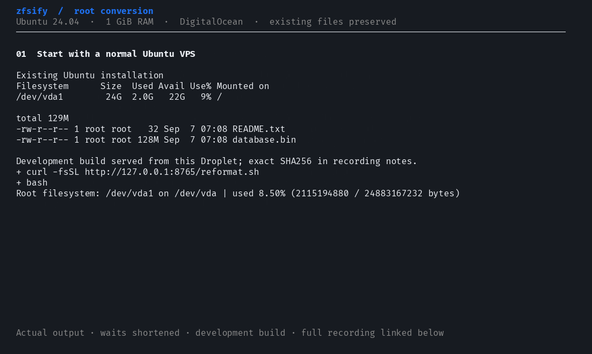
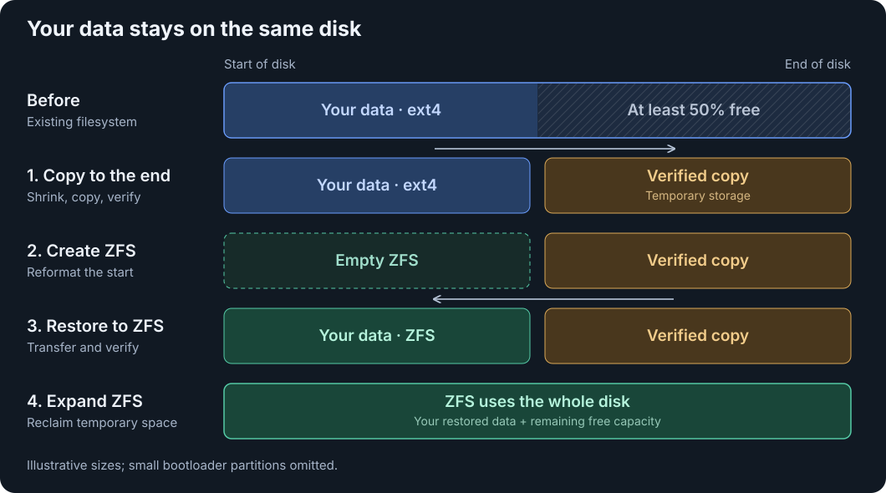
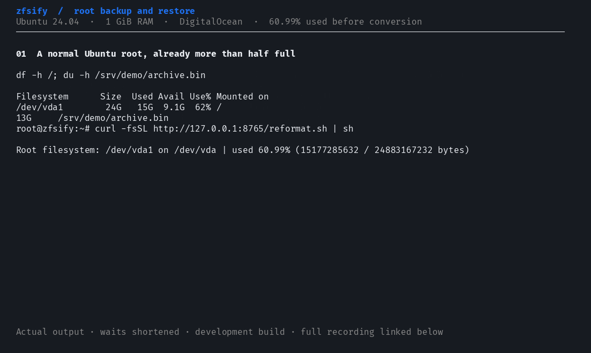
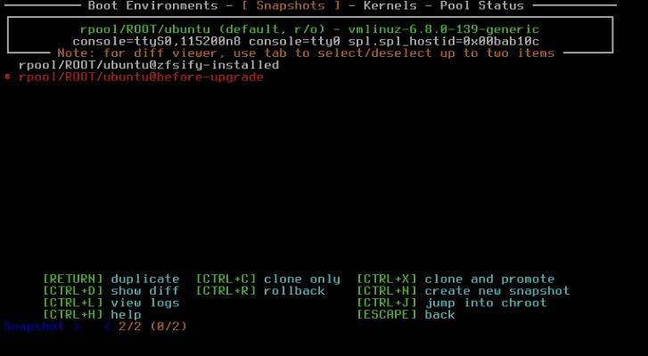
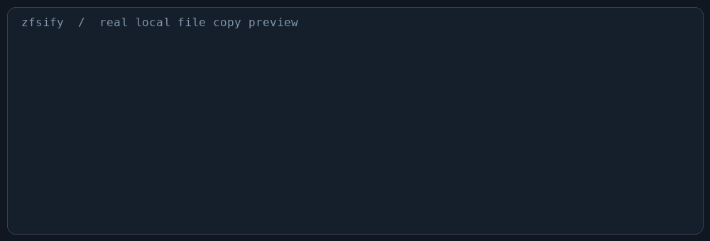
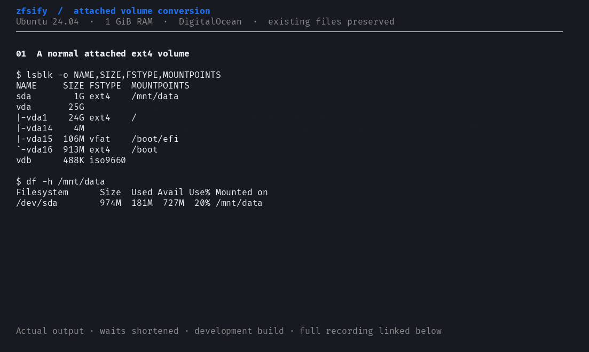

<div align="center">

# ⚡ zfsify

Convert an Ubuntu VPS or attached volume to ZFS with one command,
using the disks and data you already have.

[](#requirements)
[](#compatibility-and-validation)
[](LICENSE)

[Choose a setup](#choose-a-setup) · [Quick start](#quick-start) · [How it works](#how-it-works) · [Snapshots and recovery](#recover-from-an-unbootable-ubuntu-installation)

</div>

**Experimental:** automatic strategy selection can use [slice-by-slice root
conversion](docs/inplace.md) above 50% usage. Validate on a disposable VM first.

[](https://pirate.github.io/zfsify/docs/recordings.html?demo=root)

[Watch the conversion](https://pirate.github.io/zfsify/docs/recordings.html?demo=root)
— Ubuntu 24.04 on a 1 GiB DigitalOcean Droplet.

Cloud providers usually ship Ubuntu with ext4. Getting ZFS means building a
custom boot image or manually partitioning disks and migrating your files.
zfsify automates that work for the boot drive, including `/` and `/boot`, and
attached data volumes.

Create a normal Ubuntu VPS or volume on DigitalOcean, Vultr, Hetzner, AWS, GCP,
Azure, or another provider, then run zfsify inside Ubuntu. It transfers your
installation onto ZFS so you can use snapshots, compression, and checksums.

## Choose a setup

| Your server or disk | Use | What it does |
|---|---|---|
| Ubuntu is already running; put `/` on ZFS | [Live root conversion](#quick-start) — `reformat.sh` | Preserves the installation when space allows, installs ZFSBootMenu, and reboots onto ZFS |
| An attached ext4 volume contains files to keep | [Data-volume conversion](#data-volumes) — `reformat.sh /mnt/data` | Converts that disk and keeps its mount point; the OS keeps running |
| An attached disk can be erased | [Empty ZFS volume](docs/volumes.md) — `reformat.sh --erase /dev/disk/by-id/…` | Creates an empty ZFS data filesystem on the selected disk |
| Provision a new Ubuntu VPS with user-data | [Cloud-init templates](docs/cloud-init.md) | Schedules root or volume conversion after cloud-init finishes |
| Build or extend a named pool with multiple disks | [Advanced volume tools](docs/volumes.md#advanced-pool-and-provisioning-helpers) | Creates pools or adds mirror/stripe devices using explicit disk choices |
| Create and attach a new DigitalOcean Volume | [DigitalOcean provisioning](docs/volumes.md#interactive-setup-and-digitalocean-provisioning) | Uses the provider API through Terraform, then opens the volume wizard |

`reformat.sh` is the standalone entry point for both root and data-disk conversion.
`install.sh` contains the same installer. The cloud-init templates call that same
entry point; conversion itself needs no cloud API token.

## Quick start

Connect to your Ubuntu VPS over SSH and run:

```sh
curl -fsSL https://pirate.github.io/zfsify/reformat.sh | sudo sh
```

The default target is `/`. To select an attached volume, append its mount point
or block device. One invocation converts one disk:

```sh
curl -fsSL https://pirate.github.io/zfsify/reformat.sh | sudo bash -s -- /mnt/data
curl -fsSL https://pirate.github.io/zfsify/reformat.sh | sudo bash -s -- --erase /
curl -fsSL https://pirate.github.io/zfsify/reformat.sh | sudo bash -s -- --backup=myremote:zfsify /
curl -fsSL https://pirate.github.io/zfsify/reformat.sh | sudo bash -s -- --backup=/mnt/backup /
```

The installer detects architecture, BIOS/UEFI, disk layout and free space, and
preserves existing CPU, PCI/I/O, display, console, and network boot settings.
It shows every migration strategy, explains unavailable options, and recommends:

1. **50/50 copy and verify** when two copies fit with room for metadata.
2. **Slice-by-slice root conversion** when 50/50 does not fit but enough working
   space remains, even if a backup destination is available.
3. **External backup and restore** when neither same-disk strategy fits. This
   opens interactive Volume or rclone setup. Data volumes use this route when
   50/50 does not fit; slice-by-slice is currently root-only.

For **50/50 and slice-by-slice**, Enter or **15 seconds** accepts the default;
the selected plan has a diagram and another 15-second review with options to
proceed, review strategies, or cancel. Automatic backup fallback and interactive
erase selection wait for input.
Explicit `--preserve`, `--inplace`, `--backup`, or `--erase` bypass strategy choices.
Erase is never an automatic fallback and requires `--erase` or explicit confirmation.

Backup setup lists viable mounted ext4 destinations with device names and free
space, recommending the least occupied disk with enough room. You must select
and confirm the destination. Explicit `--backup=/path` or `--backup=remote:path`
uses your chosen destination without prompts; `--backup` alone opens the picker.
There are **no timed defaults in backup setup**. Free space does not imply a disk
is reserved for backups; no detected disk is automatically used, formatted, or deleted.
Candidates need free space for used data plus 20% and a metadata allowance.

The 50/50 strategy retains the complete ext4 copy until ZFS verification finishes;
slice-by-slice releases verified source blocks as it copies. An independent,
verified external backup offers the strongest recovery option. Boot-drive
conversion requires reboots and downtime; applications using a data volume must stop.

Take a provider snapshot or independent backup before converting important data.
A disk failure or interrupted repartitioning can affect both local copies.

## Requirements

- **Ubuntu 22.04 or later**, with root access.
- **Working space for the selected strategy.** 50/50 needs room for two copies;
  slice-by-slice needs staging and filesystem overhead; external backup needs a separate destination.
- A supported, shrinkable source filesystem and disk layout, checked by the installer.
- SSH access and access to Ubuntu package repositories. Root conversion requires
  your public key in `/root/.ssh/authorized_keys` for access to the RAM environment.

Boot-drive conversion uses a compressed RAM environment. The current preflight
requires **512 MiB RAM**, a **10 GB disk**, **3.5 GB free on `/`** for staging,
and **500 MB free in `/boot`**. It checks the actual compressed rescue size before
changing the boot entry. Package preparation may temporarily use a 512 MiB swap
file on the original disk; offline conversion uses no disk swap.

Root conversion accepts Ubuntu 22.04, 24.04, and 26.04 **amd64 or arm64**, a direct ext4
root partition on a GPT disk, and optional separate ext4 `/boot`. LVM, encrypted
source disks, RAID, multiple data partitions on the root disk, and 4K logical
sectors are refused. ARM64 requires UEFI; UEFI requires Secure Boot disabled.
Architecture and firmware are detected automatically. ARM64 builds ZFSBootMenu
using Ubuntu packages before conversion; no image selection or extra command is needed.
Ubuntu's normal kernel and ZFS packages manage the installed system; see
[Ubuntu integration](docs/recovery.md#ubuntu-integration) for the boot-layout differences.
See the [validation record](docs/validation.md) for tested releases and firmware;
provider names above describe the goal,
not a claim that every provider layout has been tested.

## How it works

To reformat the root filesystem, zfsify boots a temporary Ubuntu environment
from RAM. It can then unmount and modify the disk while providing SSH access.

1. **Copy the data to the end of the drive.** Shrink the filesystem to make room,
   then copy and verify the files in temporary storage.
2. **Set up ZFS at the start of the drive.** Reformat the front of the disk once
   the temporary copy is verified.
3. **Resilver a temporary ZFS mirror onto the front partition.** Wait for the
   complete verified copy, detach the temporary member, and expand the final
   partition. This keeps ownership, permissions, and filesystem metadata.



After verifying the transfer, zfsify removes temporary storage and expands ZFS
to fill the disk. Boot-drive conversions also configure the bootloader and
initramfs before rebooting. Small bootloader partitions are kept where required.

<details>
<summary>What happens to files and metadata?</summary>

Migration keeps persistent files and their numeric ownership, permissions,
ACLs, extended attributes, hard links, symbolic links, and sparse allocation.
Linux recreates `/proc`, `/sys`, and `/dev`; temporary, staging, and swap files
are excluded.

Boot and mount configuration is updated for ZFS, with the previous filesystem
table saved as `/etc/fstab.before-zfsify`. Files are verified before reclaiming
their source storage; the first boot follows the completed conversion.

The old root, separate `/boot`, EFI, and swap entries are replaced as needed.
zfsify rebuilds initramfs with ZFS support, disables resume from the old swap,
replaces GRUB and its update hooks with ZFSBootMenu, and records the new firmware
partition UUID. Its growth service replaces cloud-init's ext4 resize operation.

</details>

## Why does the 50/50 strategy need half the disk free?

**The disk temporarily holds two copies of your data** while each part is
reformatted. An 80 GB disk with 35 GB of data has room for another copy; one
holding 60 GB does not.

Metadata and boot partitions also take space. Below 50% used is an eligibility
check; a tightly packed filesystem can still fail the offline shrink or run out
of temporary ZFS space. Such a failure stops before deleting the original ext4
data. Automatic selection uses the actual temporary regions with a margin, then
chooses slice-by-slice or external backup when two copies do not fit.

## When the disk is more than half full

Automatic selection can use [slice-by-slice root conversion](docs/inplace.md)
or external backup while keeping your data. You can also explicitly request a
fresh installation with limited restoration using `--erase`.

### Option A: Back up elsewhere, convert, and restore everything

Run with `--backup` for guided setup: choose a temporary attached Volume, configure
cloud storage with **rclone's own CLI**, or use an existing remote. The Volume
option explains how to create and mount a disk, suggests a capacity, and lets you
refresh the disk list while you attach it. See [backup setup and cleanup](docs/backup.md).

After verifying the backup, zfsify reformats the disk as ZFS and restores the
installation. Allow time and bandwidth for uploading and downloading the backup.

[](https://pirate.github.io/zfsify/docs/recordings.html?demo=rclone)

[Watch backup and restore with rclone](https://pirate.github.io/zfsify/docs/recordings.html?demo=rclone).

<details>
<summary>Backup format and credentials</summary>

The backup archive retains Linux ownership, permissions, ACLs, extended
attributes, and links. rclone handles transfers, remote configuration, and
credentials through its standard CLI. `--backup` opens the destination wizard on
`/dev/tty`; `--backup=remote:path` or `--backup=/mnt/backup` skips the wizard.
A local destination must be an existing directory on a separate ext4 disk.
Remote credentials must be self-contained in rclone's configuration; external
credential files are refused. Encrypted configurations can use
`RCLONE_CONFIG_PASS`.

zfsify streams a sparse-aware tar archive, downloads it completely to verify
SHA-256 before erasing, and verifies the restored stream again. No uncompressed
copy is kept in RAM. The backup stays at a unique destination after conversion.

Keep the backup until the restored system is verified. Use a private destination
because the archive contains system configuration and credentials.

</details>

### Option B: Install fresh Ubuntu and restore what fits

Choose this if you can reinstall applications or discard some data. zfsify
uses available temporary storage to save files before erasure and previews what
fits: for example, **“Restore 3.200 GB of 61.500 GB”**, with files kept and omitted.

It saves complete files in this priority order:

| Priority | Data to keep |
|---|---|
| 1 | Accounts and access: user/group/password records, users' SSH configuration and keys, networking, and information needed to configure a bootable system |
| 2 | The rest of `/etc` |
| 3 | `/root` and `/home` |
| 4 | `/var`, `/opt`, `/srv`, `/usr/local`, and other application data that fits |

zfsify installs the same Ubuntu release and restores the saved files. Core
libraries, kernels, `/usr` package files, and package databases come from the fresh
OS. The preview reports eligible optional logical bytes separately from mandatory
identity data; on a 512 MiB server the optional budget is only tens of megabytes.
**Omitted files are lost unless you have another backup.** If essential account,
access, and boot information cannot fit, it stops before erasure.

Applications with incomplete files may need reinstallation. Ubuntu supplies its
own kernel, boot files, and core libraries; incompatible files are excluded from
the preview. Services with missing dependencies or data stay disabled until repaired.

## Using ZFS after conversion

Check the root filesystem and pool after reconnecting:

```sh
findmnt /
findmnt --target /boot
sudo zpool status
```

For a boot-drive conversion, `/` and `/boot` live in `rpool/ROOT/ubuntu`, so a root
snapshot includes the kernel and its modules alongside the rest of the system:

```sh
sudo zfs snapshot rpool/ROOT/ubuntu@before-upgrade
sudo zfs list -t snapshot
```

After a provider disk resize, the next boot expands the partition and ZFS pool.
zfsify handles partition growth and enables ZFS `autoexpand`.
This was verified on DigitalOcean with a 25 → 50 GiB boot-disk resize and a
2 → 3 GiB Volume resize, with no special guest commands.

<details>
<summary>Boot compatibility</summary>

GRUB is replaced by **ZFSBootMenu 3.1.0**. The BIOS layout has a 512 MiB ext4
partition at `/boot/syslinux`, loaded by Syslinux; UEFI uses a 512 MiB FAT32 ESP at
`/boot/efi`. All remaining usable space belongs to the ZFS root partition.
Ubuntu's `/boot` itself is inside ZFS, including its kernels and initramfs files.
The pool uses `compatibility=openzfs-2.1-linux`, not GRUB's restricted feature set.
Firmware still needs a small readable boot partition; ZFS does not own the GPT.
The installer does not enable native encryption.

</details>

### Recover from an unbootable Ubuntu installation

ZFSBootMenu appears before Ubuntu starts and normally boots after 15 seconds.
Use the provider's preboot console to interrupt that timer. On DigitalOcean this
is **Settings → Recovery console → Launch Console**, not the SSH-based Droplet
Console. ZFSBootMenu itself does not require an Ubuntu password to use its menu.



[View the boot menu and Droplet settings](docs/recovery.md#digitalocean-console-screenshots).

Select the boot environment, open its snapshot list with the displayed
**Snapshots** shortcut, select a known-good snapshot, and use **Clone**. Boot that
clone; it gives you a writable recovery environment while retaining the original.
The menu displays the current key bindings. Avoid **Rollback** unless you intend
to discard newer changes. See the [upstream snapshot guide](https://docs.zfsbootmenu.org/en/v3.1.x/online/snapshot-management.html).

zfsify creates an initial installation snapshot, then snapshots daily (keeps 7)
and before APT invokes dpkg (keeps 14). Only its own named snapshots are pruned;
the initial snapshot is retained. These snapshots complement provider backups.
A failure of the disk or firmware partition still needs provider recovery.
See the [recovery guide](docs/recovery.md) for the console workflow.

## Progress and recovery

The dashboard keeps overall migration phases separate from the transfer total
across all files, alongside source/target, throughput, ETA, file counts, and device
IOPS. Copy blocks advance with cumulative bytes; operations without a total show
activity instead of a percentage.
Logs and `--once` stay plain text; `NO_COLOR=1` disables color.



After reconnecting, view the same dashboard with:

```sh
zfs-on-boot-status
zfs-on-boot-status --once
```

If migration fails, use the provider-console shell; SSH is available when the
RAM environment has working networking. **Avoid rebooting after the source filesystem has been
removed**, since the RAM environment may be the only working system at that point.
For a network failure before disk migration starts, see [early recovery](docs/recovery.md#network-failure-before-disk-migration).

| Stage | Logs |
|---|---|
| Preparation | `/var/lib/zfs-on-boot/stage.log` |
| RAM environment | `/run/zfs-on-boot.log` |
| Progress and completed installation | `/var/log/zfs-on-boot/` |

## Data volumes

Convert an existing ext4 data volume using the same command with its mount point:

```sh
curl -fsSL https://pirate.github.io/zfsify/reformat.sh | sudo bash -s -- /mnt/data
```

[](https://pirate.github.io/zfsify/docs/recordings.html?demo=volume)

[Watch a data-volume conversion](https://pirate.github.io/zfsify/docs/recordings.html?demo=volume).

The [volume toolkit](docs/volumes.md) provides commands for inspecting storage,
creating ZFS data pools, and adding stripe or mirror devices. Its guide covers
usage, requirements, and limitations.

## Provision with cloud-init

Paste one template into your provider's **user-data** field when creating an
Ubuntu VPS:

- [`cloud-init/root.yml`](cloud-init/root.yml): preserve and convert the new VPS's
  boot disk, with two reboots after initial provisioning.
- [`cloud-init/volume.yml`](cloud-init/volume.yml): convert one attached disk;
  edit its target and explicitly choose whether it may be erased.

Both schedule the installer after cloud-init completes and record an attempt
marker to prevent reboot loops. See the [cloud-init guide](docs/cloud-init.md)
for SSH keys, disk selection, status, and failure handling.

## Repository map

| Path | Purpose |
|---|---|
| [`reformat.sh`](reformat.sh), [`install.sh`](install.sh) | Standalone installer and identical alias |
| [`cloud-init/`](cloud-init/) | First-boot provisioning templates |
| [`src/`](src/) | Installer source: preflight, RAM environment, migration, boot, backup, and growth |
| [`tools/volumes/`](tools/volumes/) | Advanced pool, inventory, and benchmark commands |
| [`tools/digitalocean/`](tools/digitalocean/) | DigitalOcean Volume provisioning and metadata commands |
| [`docs/`](docs/) | Usage guides, recordings, and validation evidence |
| [`scripts/`](scripts/) | Packaging, disposable DigitalOcean/ARM64 tests, and recordings |

## Compatibility and validation

The implementation includes root and ext4 data-volume conversion, ZFSBootMenu,
rclone archive recovery, and bounded priority restore. DigitalOcean runs have
booted Ubuntu 22.04 with **512 MiB** and Ubuntu 24.04 with **1 GiB**, preserved
files and metadata, restored backups, and expanded boot disks and Volumes after
provider resizing. The 512 MiB preservation and priority-restore paths also
passed subsequent reboots. See the [validation record](docs/validation-zfsbootmenu.md)
for exact configurations, installer versions, and evidence.

Other providers and a complete interactive recovery through DigitalOcean's
browser console are not yet validated.

The [validation index](docs/validation.md) lists the supported configurations and
available evidence. Cloud-init templates and advanced multi-disk helpers have
separate coverage from the recorded root and single-volume conversions.

See [CONTRIBUTING.md](CONTRIBUTING.md) for implementation and testing instructions.

## Related projects

- [OpenZFS](https://github.com/openzfs/zfs) provides the filesystem used by zfsify.
- [rclone](https://rclone.org/) supports transfers to S3 and other storage services.
- [zfsbox](https://github.com/pirate/zfsbox) runs virtualized ZFS on macOS, Linux, and Docker.
- [ZFSBootMenu](https://zfsbootmenu.org/) provides ZFS boot-environment selection and recovery tools.
