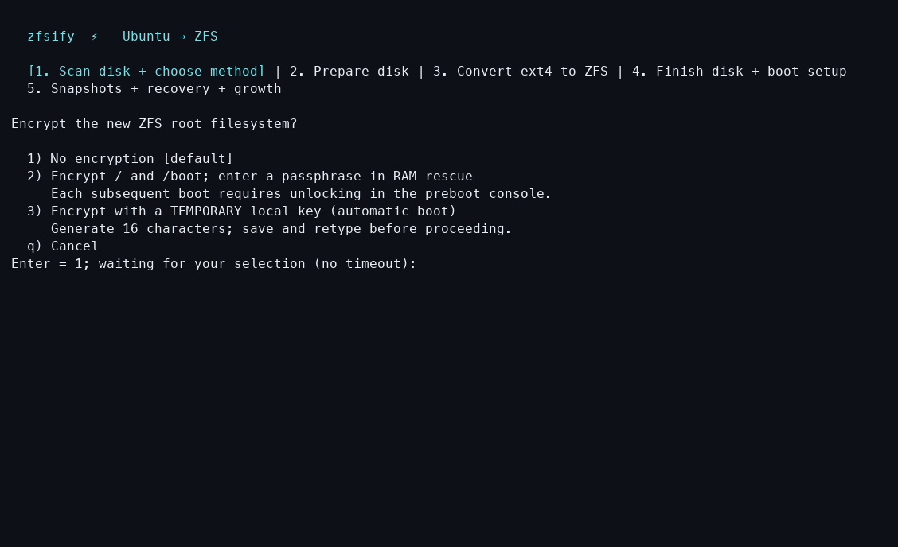
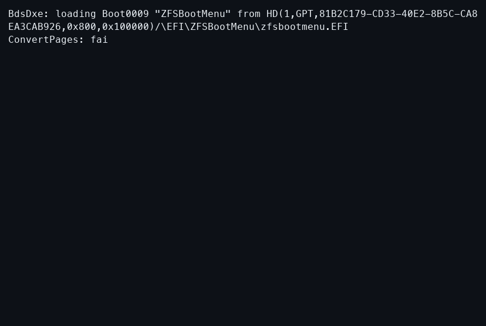
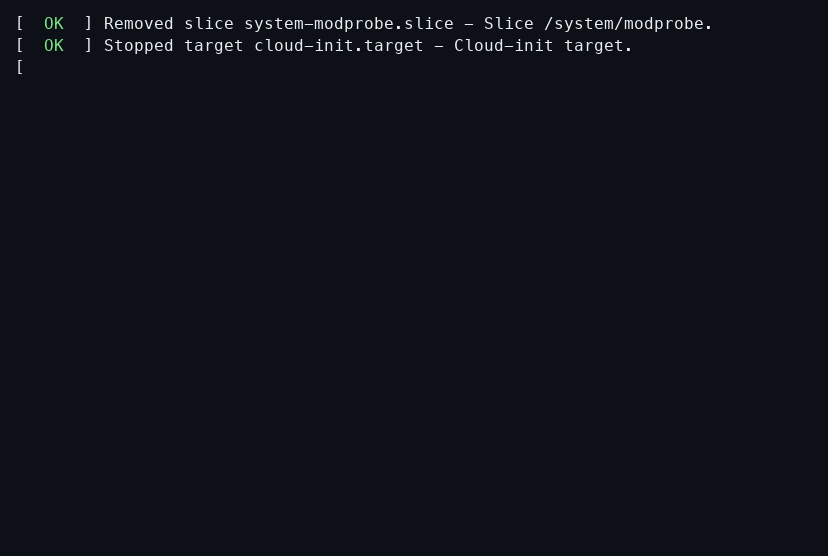

# Encrypted root

`--encrypt` creates native ZFS AES-256-GCM encryption on `rpool`; its root dataset
inherits encryption. Ubuntu's `/boot` is inside the encrypted filesystem. The
small firmware/ZFSBootMenu partition and pool metadata remain unencrypted.

See [encrypted-root validation](evidence/encryption-2026-10-03.md) and
[temporary-key and passphrase-change validation](evidence/encryption-2026-10-04.md).

## Temporary plaintext boot key

Choose **Encrypt with a TEMPORARY local key** in the TUI. It generates exactly
16 alphanumeric characters, displays them, and waits until you save and retype
the key. There is no timeout or automatic acceptance. The short, readable format
is deliberate: you may need to hand-transcribe it from a recovery console, and
it is a temporary credential to replace after bootstrap.

For headless use, **supply your own saved key** through the environment:

```sh
read -r -s -p 'Temporary key (save it first): ' ZFSIFY_ENCRYPT_KEY; echo
export ZFSIFY_ENCRYPT_KEY
curl -fsSL https://pirate.github.io/zfsify/reformat.sh | sudo --preserve-env=ZFSIFY_ENCRYPT_KEY bash -s -- \
  --yes --encrypt
unset ZFSIFY_ENCRYPT_KEY
```

Or pass `--yes --encrypt --encrypt-key='YOUR-SAVED-TEMPORARY-KEY'`. CLI secrets
can appear in shell history and process arguments; prefer the environment.
Do not put real keys in cloud-init user data or shared logs. Both forms print
the same warning and save the supplied key for automatic boot. They never
silently generate a key and require no remote server.

Encryption stays **off by default**. `--encrypt` with no key source uses a
human-entered passphrase in RAM rescue. `--yes --encrypt` requires a supplied key
or key URL. Key-source arguments/environment alone do not enable encryption.


[Terminal recording](assets/recordings/encryption/setup.cast)

> [!CAUTION]
> **THIS DEFEATS DISK ENCRYPTION while the plaintext boot key is present.**
> Anyone who obtains the boot disk or its snapshots can decrypt the server.
> This is a temporary bootstrap convenience: later remove the boot key **and
> change the passphrase**, then use a person or remote system at boot.
> Rotation is fast and does not rewrite data, but it cannot revoke old copies
> of the key plus disk metadata. Old snapshots, backups, deleted blocks and SSD
> remapping can retain those copies. Retiring an exposed **data key** requires
> copying into a newly created encrypted dataset/pool and retiring the old data.
> See [OpenZFS key rotation](https://openzfs.github.io/openzfs-docs/man/v2.2/8/zfs-load-key.8.html).

The installer prints the warning in bold red. The temporary key is embedded in
`zfsify-hooks/load-key.d/zfsify-plaintext-key` on the unencrypted boot partition:
`/boot/efi` for UEFI, `/boot/syslinux` for BIOS. zfsify does not create a `bpool`.
The rescue image also contains the bootstrap key so interrupted migrations can
resume. Root's normal key and Ubuntu initramfs stay inside encrypted ZFS.

### Switch to a custom passphrase later

Do this on the running, unlocked server, with its preboot console available.
These steps change the wrapping key, **not** every data block. They do not erase
old disk copies or provide [FileVault's hardware-backed anti-replay guarantee](https://support.apple.com/en-mide/guide/deployment/dep82064ec40/web).

1. Save a new passphrase and apply it to `rpool` (input is hidden):

   ```sh
   sudo python3 - <<'PY'
   import getpass, os, pathlib, subprocess
   key = getpass.getpass('New ZFS passphrase: ')
   if key != getpass.getpass('Confirm passphrase: ') or not 8 <= len(key.encode()) <= 512:
       raise SystemExit('Passphrases must match and contain 8–512 UTF-8 bytes.')
   os.umask(0o077)
   path = pathlib.Path('/etc/zfs/zfsify-rpool.key.next')
   path.write_text(key)
   subprocess.run(['zfs', 'change-key', '-o', 'keylocation=file://' + str(path), 'rpool'], check=True)
   path.replace('/etc/zfs/zfsify-rpool.key')
   subprocess.run(['zfs', 'set', 'keylocation=file:///etc/zfs/zfsify-rpool.key', 'rpool'], check=True)
   PY
   ```

2. Rebuild Ubuntu's initramfs using its installed tool:

   ```sh
   sudo sh -ec 'umask 077
   if command -v update-initramfs >/dev/null; then
       update-initramfs -u -k all
   else
       for kernel in /boot/vmlinuz-*; do
           version=${kernel##*/vmlinuz-}
           dracut --force "/boot/initrd.img-$version" "$version"
       done
   fi
   chmod 600 /boot/initrd.img-*'
   ```

3. On the mounted boot partition, remove **only**
   `zfsify-hooks/load-key.d/zfsify-plaintext-key`. Reboot and enter the new
   passphrase in ZFSBootMenu. Keep it in your password manager. If a rebuild
   fails, fix it before rebooting; retain the new passphrase for recovery.
4. Take a new root recovery snapshot after the successful boot. Older snapshots
   contain old key files/initramfs images and may require repair before booting;
   changing the passphrase does not update them. Set up
   [remote unlocking](remote-unlock.md) when ready.

### Boot recordings

Automatic boot with the temporary key:


[Terminal recording](assets/recordings/encryption/automatic-boot.cast)

After removing the boot key and changing the passphrase:


[Terminal recording](assets/recordings/encryption/passphrase-boot.cast)

## Interactive setup

Select encryption in the root-conversion menu, or pass `--encrypt`. Review and
confirm the conversion as usual. After booting the RAM rescue environment, it
waits for a passphrase before changing the disk. Enter it twice in the console,
or reconnect using your existing root SSH key and run:

```sh
zfsify-unlock
```

Use `ssh -t root@SERVER zfsify-unlock` to run it directly. Input is hidden and read
from the terminal, never from the `curl | sh` stream. Keep a separate copy of the
passphrase: losing it means losing access to the encrypted data. Use characters
available in your preboot console’s keyboard layout.

## Headless conversion

```sh
curl -fsSL https://pirate.github.io/zfsify/reformat.sh | sudo bash -s -- \
  --yes --preserve --encrypt --encrypt-key-url=https://keys.example.net/my-server
```

The URL requires `--encrypt` and can be combined with any root conversion method.
It must return a single UTF-8 passphrase of 8–512 bytes, optionally followed by
one newline. HTTPS certificates are verified, including public CA certificates
installed in the original Ubuntu's `/usr/local/share/ca-certificates`. Redirects,
embedded credentials, query strings and fragments are rejected.

**The URL is stored on the unencrypted rescue disk and is not an access secret.**
Restrict access at your key server, for example to the server's source address;
anyone able to retrieve that response can unlock the pool. The key itself is
fetched only in RAM after reboot and is never embedded in the rescue image.
The key server must be reachable from that environment. Failed retrieval stops
conversion before repartitioning or releasing source data; wrong keys on resume
stop further migration.
Keep the same key available until conversion and recovery testing are complete.

Without a supplied local key, `--yes --encrypt` requires a key URL.
The key URL does **not** enable unattended boot: the URL is not installed
as a permanent network unlock service.

## Boot and recovery

Enter the passphrase in ZFSBootMenu using your VM's serial/display console or
your provider's preboot recovery console. A console that depends on the running
Ubuntu SSH service cannot unlock an unbooted machine. Preboot SSH unlocking is
not configured by zfsify.

Following [ZFSBootMenu's native-encryption setup](https://zfsbootmenu.org/en/latest/general/native-encryption.html),
the key is stored root-only at `/etc/zfs/zfsify-rpool.key` inside the encrypted
root and its final Ubuntu initramfs. This avoids a second unlock prompt and
supports snapshot recovery. Kernel updates retain this configuration with
initramfs-tools or dracut. Except for the explicitly unsafe bootstrap option
above, never copy that key to the unencrypted firmware partition. Never copy
the final Ubuntu initramfs there; treat exported initramfs files as secrets.

After an interrupted slice-based conversion, boot the persistent rescue entry
and supply the same passphrase again (or retain access to the same HTTPS key).
Do not change the key mid-conversion. Rotating keys after installation also
requires updating the key file, initramfs and your snapshot recovery plan.

This encrypts the new filesystem; it is not secure erasure of the previous ext4
installation. Old free blocks, provider snapshots, rescue metadata and retained
backup archives may still disclose old data. Configure encryption separately
for external backups, such as an rclone crypt remote.
