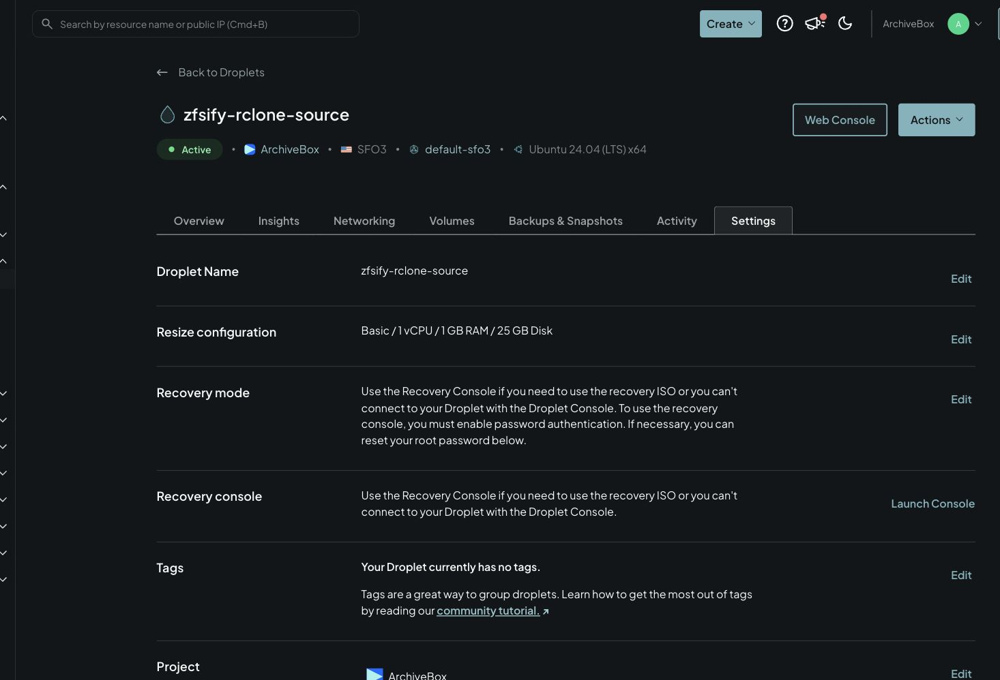
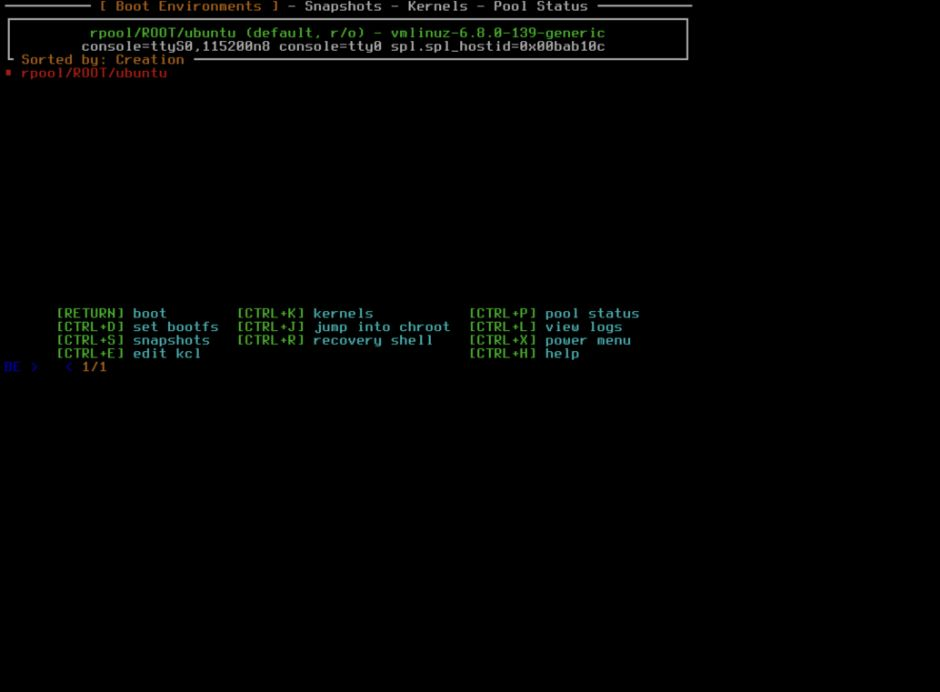

# Snapshots and boot recovery

ZFSBootMenu starts before Ubuntu and reads boot environments directly from ZFS.
Each root snapshot includes `/boot`, kernels, initramfs files, kernel modules,
configuration, and application data on that root dataset. A usable snapshot can
therefore provide an environment to repair an Ubuntu installation that cannot boot.

Keep provider backups or an independent backup too. Root snapshots share the
same disk and do not protect against loss of that disk or its firmware partition.

## Network failure before disk migration

`Nexthop has invalid gateway` followed by failure at the `network.sh` step means
the RAM environment could not restore routing. This step runs **before any disk
resize, formatting, or data migration**. See [issue #1](https://github.com/pirate/zfsify/issues/1).

For that specific early failure, save the console output, then run `reboot -f`
from the RAM console. The installer uses a one-time GRUB entry; select the normal
Ubuntu entry if the boot menu appears. Do not use this procedure for a failure
after migration has started.

Once back in the original Ubuntu with `/` mounted as ext4, preserve the staging
log and remove only the failed installer staging files before retrying:

```sh
findmnt -no SOURCE,FSTYPE /
sudo cp /var/lib/zfs-on-boot/stage.log /root/zfsify-failed-stage.log
sudo rm -f /etc/grub.d/41_zfs_on_boot
sudo update-grub
sudo rm -rf -- /var/lib/zfs-on-boot /boot/zfs-on-boot
curl -fsSL https://pirate.github.io/zfsify/reformat.sh | sudo sh
```

The installer captures the server's current routes. Direct routes, including
gateway host routes for `/32` addresses, are restored before routes through a
gateway. Interface matching uses MAC addresses rather than provider-specific
interface names or hardcoded gateways, and NIC MTUs are retained.

## Kernel and console settings

Existing kernel options for consoles, interface naming, CPU, display, and I/O
are carried into the new boot configuration. Old root-filesystem, swap-resume,
and one-time installer settings are removed. The RAM image includes the detected
boot-disk controller modules and their dependencies. Existing `/etc/sysctl*`
and module configuration remain part of the migrated Ubuntu installation.

To inspect the Ubuntu kernel arguments used for ZFS boot:

```sh
zfs get org.zfsbootmenu:commandline rpool/ROOT
```

ZFSBootMenu supplies `root=` for the selected dataset or snapshot clone;
do not add a fixed `root=` value to that property.

## Create recovery points

zfsify creates `@zfsify-installed` after conversion, takes daily root snapshots
(retains 7), and snapshots before APT invokes dpkg (retains 14). It only prunes its
own automatic snapshot names. The installation snapshot and user-named snapshots
are retained; snapshots held or used by a clone cannot be pruned normally.

Create an additional checkpoint before work that may affect boot or applications:

```sh
sudo zfs snapshot rpool/ROOT/ubuntu@before-upgrade
sudo zfs list -t snapshot
```

For databases and other stateful applications, arrange application-consistent
checkpoints or backups as appropriate. Attached data pools have their own datasets;
a root snapshot does not include their contents.

## Open the preboot console

On DigitalOcean, open the Droplet, choose **Settings**, then find **Recovery
console** and click **Launch Console**. This is the provider's display/keyboard
console; the SSH-based **Web Console** cannot show preboot menus.

Reboot normally if Ubuntu is running. ZFSBootMenu normally counts down for 15
seconds before booting the default environment; interrupt that countdown to use
the menu. Click inside the console to give it keyboard focus. Browser or desktop
shortcuts can intercept key combinations; follow the keys shown by the menu.

DigitalOcean's password-reset instructions concern logging into Ubuntu or the
provider recovery ISO. ZFSBootMenu's environment and snapshot menus run before
Ubuntu and do not require resetting the Ubuntu root password.

## Choose an older environment

1. Select the Ubuntu boot environment and open **Snapshots** using its displayed
   shortcut (`Ctrl+S` in these screenshots).
2. Choose a known-good snapshot. **Clone only** creates a writable environment
   sharing unchanged blocks with the snapshot. **Duplicate** makes a full copy
   and needs more time and free space.
3. Return to the boot-environment list, select the new environment, and boot it.
4. Inspect and repair the installation from that environment. Set a new default
   only after deciding which environment you want to keep using.

**Rollback** discards newer changes; it is different from creating a recovery
environment. Read the [ZFSBootMenu snapshot guide](https://docs.zfsbootmenu.org/en/v3.1.x/online/snapshot-management.html)
before using destructive recovery operations.

## DigitalOcean console screenshots

These images were captured from DigitalOcean's actual Droplet administration page
and Recovery Console on 2026-09-07. The machine was the Ubuntu 24.04, 1 GiB / 25 GiB
Droplet used for the [rclone conversion recording](recordings.html?demo=rclone).
They are browser captures, not illustrations or a locally simulated console.

### Droplet settings and console entry



### Boot environments



### Snapshot selection


The menu was held open with `zbm.timeout=-1` on this disposable machine for
capture; the shipped installer uses a 15-second countdown. The `before-upgrade`
snapshot was created for the demonstration. Some captures are cropped to the
relevant page or terminal region; their displayed content is unchanged.

The screenshots establish that the provider console reaches ZFSBootMenu and its
snapshot picker. A separate boot test booted a snapshot clone with a damaged
original environment, as recorded in the [validation report](validation-zfsbootmenu.md).
They do not establish a complete interactive clone-and-boot recovery run. The
test Droplet is disposable and is removed after capture.
