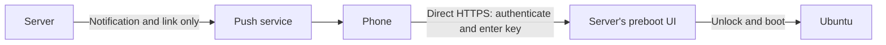

# Unlock later, from your phone

A locked server can wait for a human for hours or days. During conversion,
zfsify's console/SSH `zfsify-unlock` prompt already waits without a deadline.
After conversion, ZFSBootMenu can wait for a passphrase too, but its networking
is separate from Ubuntu's. Ubuntu's web UI cannot run while its own root is
locked. TrueNAS's running management OS can unlock separate data pools; encrypted
root needs the equivalent interface inside the preboot environment.

## A four-step integration using existing tools

This is a proposed integration, **not a shipped or end-to-end tested zfsify
feature**. It avoids writing a new authentication/web server, but still needs a
custom ZFSBootMenu image and testing on the target network.

1. **Convert with encryption.** Use `--encrypt`, or use the temporary local-key
   option while setting up access. Follow ZFSBootMenu's
   [remote-access guide](https://zfsbootmenu.org/en/latest/general/remote-access.html)
   to build a boot image with working networking and authenticated SSH as a
   recovery path. Give the preboot environment a stable address. Its image and
   network must work without mounting the locked root.
2. **Serve the unlock UI directly from that image.** Bundle
   [ttyd](https://github.com/tsl0922/ttyd), its dependencies and dedicated TLS
   credentials; launch `zfsbootmenu` in its web terminal. Require a separate
   strong login or client certificate, validated HTTPS, same-origin checking,
   and one writable client. Keep it on a private network/VPN where possible.
   This reuses the actual ZFSBootMenu passphrase UI; it is not an unauthenticated
   endpoint that accepts keys. Include the service startup before ZFSBootMenu's
   local unlock wait, and leave it listening across disconnected clients.
3. **Send a notification containing only a link.** A boot hook can publish
   “Server waiting for unlock” with an
   [ntfy click URL](https://docs.ntfy.sh/publish/#click-action) pointing directly
   to your server's HTTPS address. Never put a passphrase, login token or
   credentials in the notification or URL. Start notifications asynchronously
   with retry/backoff so an unavailable push service cannot block unlocking.
4. **Tap whenever convenient, authenticate, unlock and boot.** The phone connects
   directly to the server's authenticated TLS web terminal; the passphrase goes
   into ZFSBootMenu, not ntfy. No expiry or automatic reboot should end the wait.
   Remove the temporary boot key and rotate its passphrase only after testing
   this path. Verify a delayed connection, a wrong key, a network outage and a
   successful reboot before depending on it.

The notification provider sees the message and destination URL, never the key.
Do not terminate TLS at a third-party proxy or use an externally hosted terminal:
those would change that guarantee. Phone reachability, certificate renewal and
preboot network configuration still need setup. The boot filesystem contains
server identity credentials, so physical tampering or copied credentials also
need consideration. An SSH client on the phone is the smaller alternative to a
web UI; ZFSBootMenu already documents that path.

## Push versus polling

For human input, a listening SSH/web session is simpler than repeatedly fetching
a secret. It can stay available indefinitely and accept input when the person
arrives. Notification delivery and unlock availability should be independent.

A future polling hook could instead query a key server with bounded request
timeouts and backoff, treating “not yet approved” as a continued locked wait.
It must authenticate the booting server, validate TLS, retain the key only in RAM
and never fall back to a plaintext disk key on network failure. Changing remote
policy from automatic release to human approval does not rewrite any ZFS data.
The existing `--encrypt-key-url` is a one-shot **migration-time** fetch, not this
boot-time polling service. Neither remote setup is required for local console
unlocking or the explicitly selected temporary plaintext-key mode.
